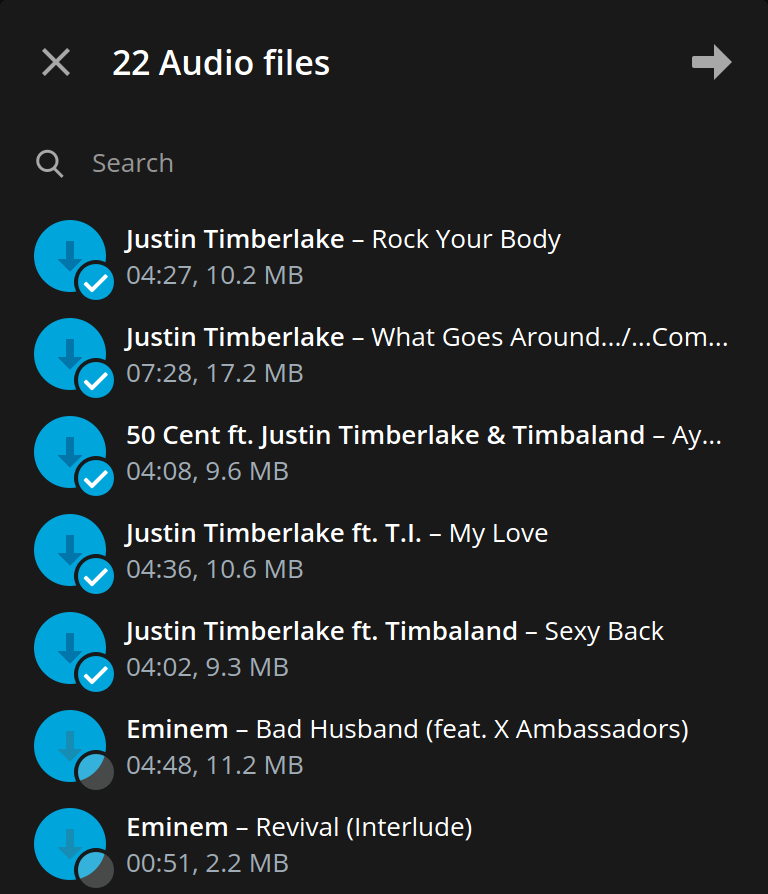
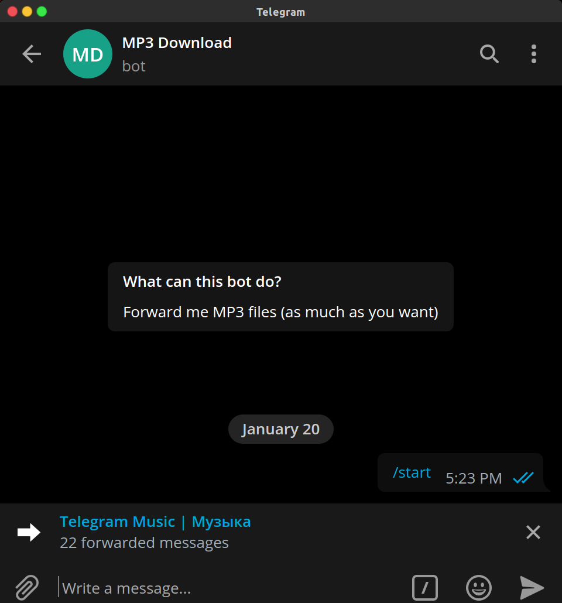
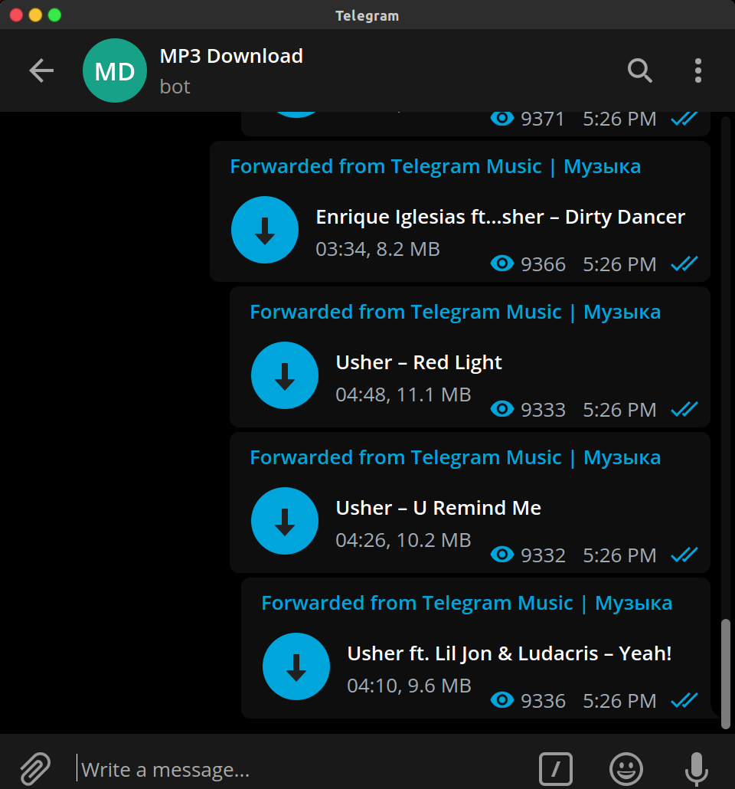
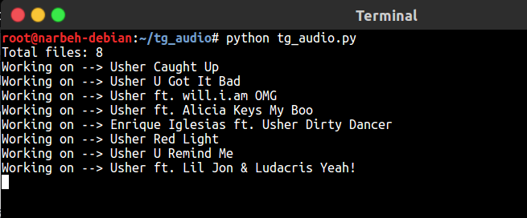
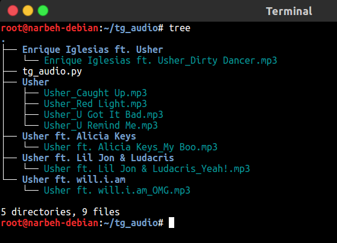

# **Telegram Audio Download**

This script uses Telepot python framework to connect to Telegram's API in order to control your bot. After creating your bot via @BotFather, paste your bot's token in the script then run it. You can simply forward as many as audio files (Max 100 files by Telegram)  to your bot and it'll download the forwarded files. It will simply skip the files which have been downloaded already.

### Requirements

You only need `telepot` for this.

`pip3 install telepot`

### Usage

`python3 tg_audio.py`

### TODO

- Enable Video/Document option

### Screenshots

